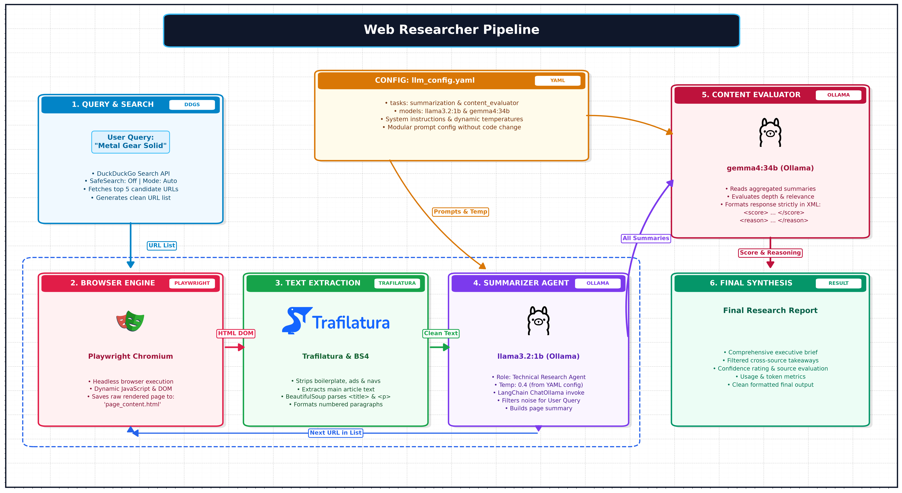

# Web Researcher Pipeline

An autonomous, framework-agnostic AI agent pipeline designed to conduct web research, scrape live web pages, extract high-signal textual content, synthesize multi-source findings with local LLMs, and evaluate response quality.

---

## 📌 Architecture & Flow Diagram

The complete pipeline execution flow is illustrated below:



---

## 🚀 Pipeline Workflow

1. **Query & Search (`web_helpers.py`)**
   - Takes a search query from the user (e.g. `"Metal Gear Solid"`).
   - Executes search using DuckDuckGo (`ddgs`) with `safesearch="off"` and backend auto-negotiation.
   - Collects top-K relevant web URLs into a candidate list.

2. **Browser Engine & Snapshot (`playwright_helper.py`)**
   - Iterates through the discovered URLs inside a terminal progress loop (`tqdm`).
   - Uses **Playwright Headless Chromium** to load full JavaScript-rendered DOM trees.
   - Captures dynamic web content and saves raw markup to `page_content.html`.

3. **Text Extraction & Cleaning (`run.py` / `Trafilatura` & `BS4`)**
   - Extracts page titles (`<title>`) and iterates through all `<p>` tags with BeautifulSoup4 and Trafilatura.
   - Strips boilerplate (navbars, ads, headers, footers).
   - Prepares an indexed paragraph dump for LLM ingestion.

4. **Summarization Agent (`web_helpers.py` via `ChatOllama`)**
   - Ingests page content, user query, and task configuration from `llm_config.yaml`.
   - Uses a local LLM (e.g., **`llama3.2:1b`**) via `langchain-ollama` using structured `SystemMessage` and `HumanMessage` prompts.
   - Filters noise to retain only information strictly relevant to the user query.
   - Aggregates individual page summaries into an overarching research corpus.

5. **Autonomous Content Evaluation (`summary_scorer`)**
   - Feeds the aggregated summaries to an evaluator model (e.g., **`gemma4:34b`** or **`qwen3.5:4b`**).
   - Evaluates factual depth, relevance to original user prompt, and summary coherence.
   - Returns output structured in XML:
     ```xml
     <score>...</score>
     <reason>...</reason>
     ```

6. **Final Synthesis & Report Delivery**
   - Produces an executive research brief combining verified facts, quality scores, and token latency telemetry.

---

## ⚙️ Configuration (`llm_config.yaml`)

System instructions and generation parameters (temperature) are completely decoupled from code logic:

```yaml
tasks:
  summarization:
    models: 
      llama3.2:1b:
        system_instructions: >
          You are a web research agent. Analyze the provided content and return 
          a technical, executive, and comprehensive summary relevant to the user query.
        temperature: 0.4
  
  content_evaluator: 
    models:
      gemma4:34b:
        system_instructions: >
          You are an executive assistant. Read the content given by another AI 
          assistant and score it. Return a JSON/XML format with <score> and <reason> tags.
        temperature: 0.6
```

---

## 🛠️ Tech Stack

- **Web Search**: `ddgs` (DuckDuckGo Search)
- **Headless Browser**: `playwright` (Chromium engine)
- **HTML Parsing**: `beautifulsoup4`, `trafilatura`
- **LLM Engine**: `ollama` with `langchain-ollama` (`ChatOllama`)
- **CLI Telemetry**: `tqdm`
- **Diagramming**: `matplotlib`, `pillow`, `resvg-py`

