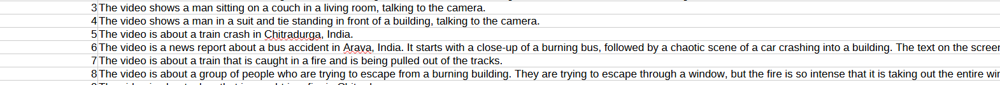
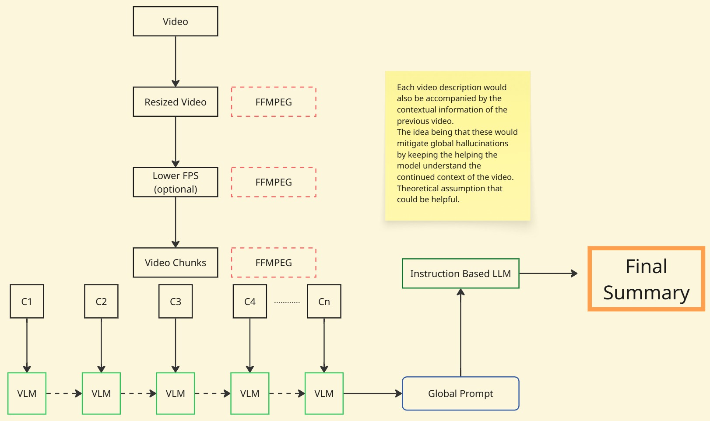

# Video Understanding through LLM

  

* Goal is to convert raw video -> semantic understanding -> Summary 

- On a general level, video understanding through deep learning models take place with the help of shared feature extraction. 
Instead of one features, the models like SlowFast, MViT are temporal based which take the features from multiple frames and do extraction from them to classify what **actions** are happening in the video. 
- More like video segment since LLM's can work on segments of video as it ultimately analyzes a sequence of frames. 
- Working on open source models is another challenge since I need to work with hardware constraints.

- Hardware constraints lead to another interesting challenges 
1. Models should be good enough to work on videos in a reasonable time
2. Video will require some amount of preprocessing to save inference computation
3. Sending a full video to the VLM will definitely crash the system due to VRAM growth so video has to be divided into chunks. 
4. Division of video into chunks will require another set of engineering to get __overall__ summary from the video.

## Flow - I


- Description of each chunk leads to local understanding for each clip. 
- Does it lead to global understanding of whole video - Summary.
- As a human we are pertrained to understanding with previous contexts for nearly everything. 
- Just sending description of every 6s is enough or will it be missing lots of temporal information.



- These are the llm responses. 
- Each response pertains to description of one video 
- The reconcile file takes these descriptions, concatenates them and sends them to the llm (preferably another one which is more handled to text based work rather than vision based)


```python
streamlit run app.py
```

> Enter the link of the Youtube video you need the summary for. Make sure that the video is a public one and not private.



- [] Instead of using individual video description, the idea would be to send each video clip to the vlm along with the previous clips contexts. 
A bit change on the prompt would be required. 
- The idea is that will be the vlm understand and make better generalization of whats happening in the video if it has an idea of what has happened previously ?
- [] Would cost a lot of overhead in token size though. Compute wise might be difficult for the local machine. 
